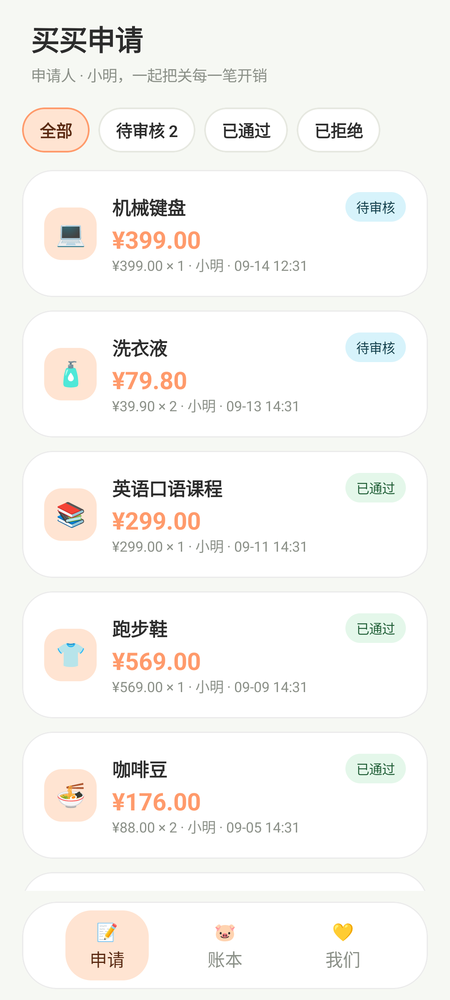
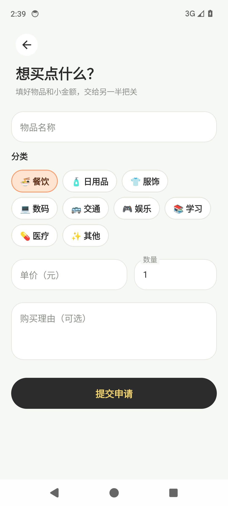
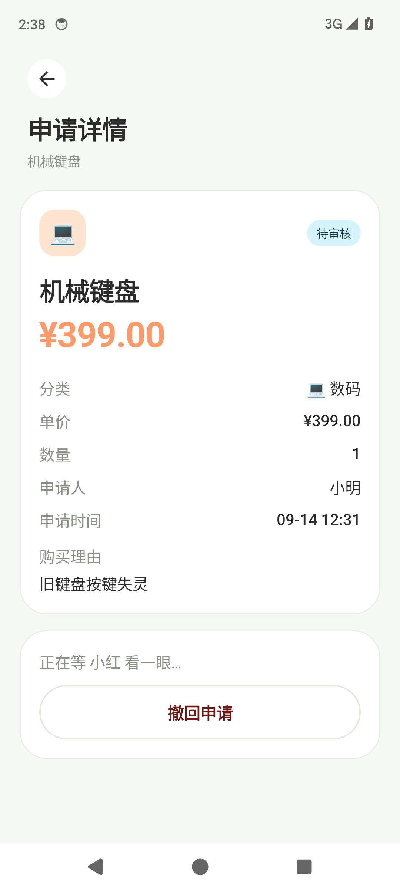
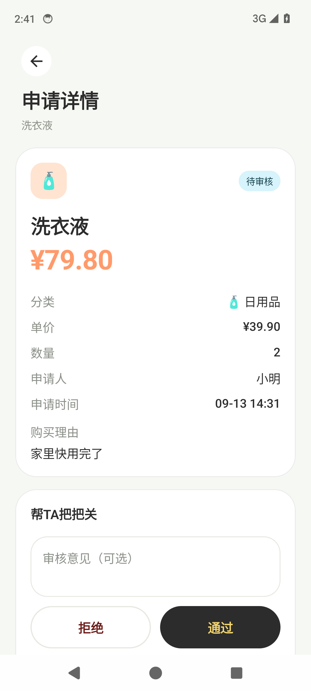
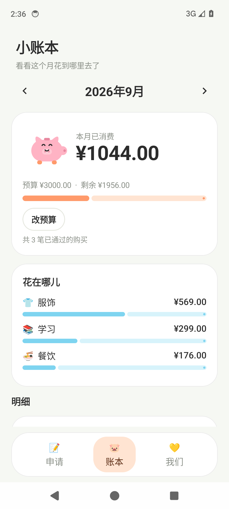
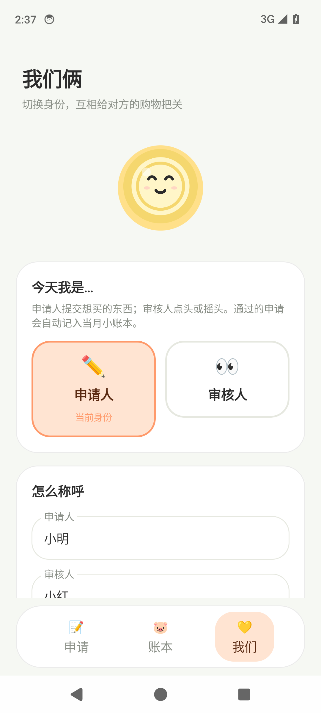

# 省钱助手（saveMoney）

一个用于两人协作的购买申请审核与月度消费记录安卓应用。

- **申请人**提交购买物品的申请（物品、分类、单价、数量、理由）
- **审核人**审核申请：通过或拒绝，并可填写审核意见
- **审核通过**后自动生成一条消费记录，计入当月消费
- 按月查看消费总额、预算余额、分类占比与明细

## 功能页面

| 页面 | 说明 |
| --- | --- |
| 申请 | 申请列表，按「全部 / 待审核 / 已通过 / 已拒绝」筛选；申请人可新建申请，点击进入详情 |
| 申请详情 | 查看申请信息；审核人可通过/拒绝；申请人可撤回待审核的申请 |
| 消费 | 月份切换、本月已消费、预算与剩余、分类占比、消费明细；可设置每月预算 |
| 我的 | 切换当前身份（申请人 / 审核人），修改成员名称 |

数据仅保存在本机（Room 数据库）。两人共用一台设备时，在「我的」页切换身份即可。

## 界面截图

奶油底、大圆角卡片、睡着的小金币和深色金色胶囊按钮，风格偏轻量生活 App。截图来自 Android 14 模拟器。

| 申请列表 | 新建申请 | 申请详情（申请人） |
| --- | --- | --- |
|  |  |  |

| 审核人审核 | 小账本 | 我们俩 |
| --- | --- | --- |
|  |  |  |

## 技术栈

- Kotlin 2.0 · Jetpack Compose · Material 3
- Room（KSP）持久化，审核与记账在同一事务内完成
- Navigation Compose · ViewModel · Kotlin Flow
- minSdk 26，compileSdk / targetSdk 35

## 构建

```bash
# 需要 JDK 17+ 与 Android SDK（compileSdk 35）
./gradlew assembleDebug          # 生成 app/build/outputs/apk/debug/app-debug.apk
./gradlew testDebugUnitTest      # 运行单元测试
```

若未使用 Android Studio，请在项目根目录创建 `local.properties` 并写入 `sdk.dir=/path/to/android-sdk`。

## 项目结构

```
app/src/main/java/com/savemoney/app/
├── MainActivity.kt          # 导航与底部栏
├── AppViewModel.kt          # 业务状态：申请、消费、预算、身份
├── SaveMoneyApp.kt          # Application，持有数据库实例
├── data/
│   ├── Entities.kt          # PurchaseRequest / ExpenseRecord / MonthlyBudget
│   ├── Daos.kt              # DAO 与审核事务
│   └── AppDatabase.kt
└── ui/
    ├── RequestListScreen.kt
    ├── NewRequestScreen.kt
    ├── RequestDetailScreen.kt
    ├── ExpensesScreen.kt
    ├── ProfileScreen.kt
    ├── Common.kt            # 金额/日期格式化、分类、状态标签
    └── theme/Theme.kt
```
