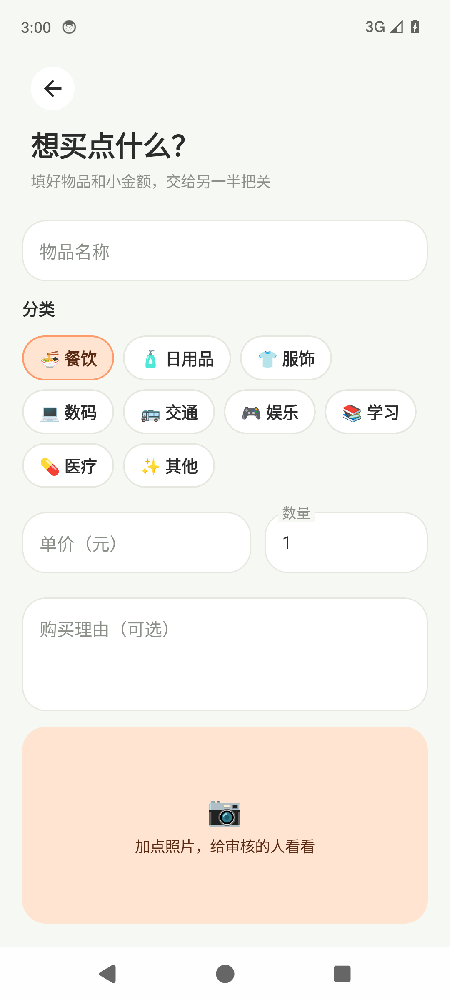
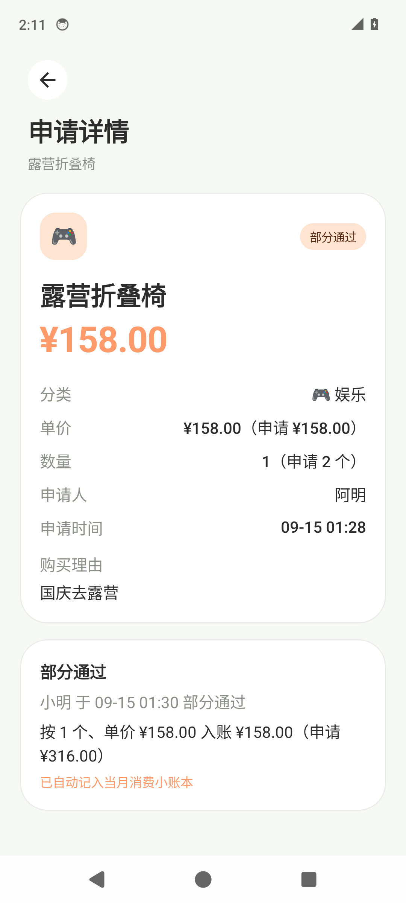
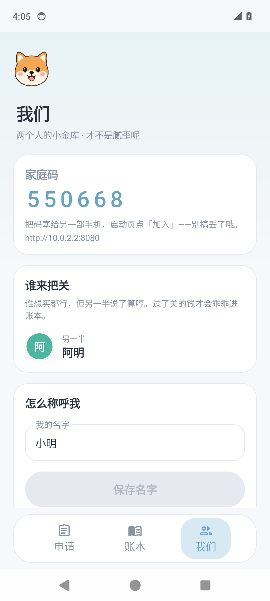
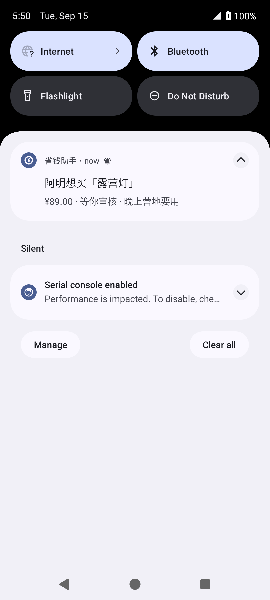
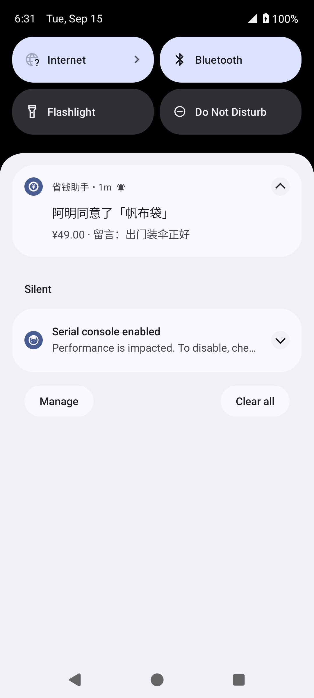

# watchMoney

两人协作的购买申请审核与月度消费记录。**数据存在自己的后端**，两部手机用同一个家庭码同步申请、审核、照片和账本。

- 两个人**谁都可以**发起购买申请（可附照片）
- 每一条申请由**另一个人**通过或拒绝，不能审自己的；通过时可以改数量或单价，但总额不能超过申请金额，入账按改过的金额
- 按月看总额、预算、分类占比和明细
- 对方提交申请或给出审核结果时收到**系统状态栏通知**（需授予通知权限）：App 打开时每 30 秒刷新，放到后台后大约 20 秒会检查一次，之后约每 15 分钟再查。不依赖 Google 推送。部分手机厂商会限制后台任务，需允许自启动/关掉电池优化。

## 两部手机怎么一起用

1. 在电脑或云主机上启动后端（见下方）。
2. 第一部手机打开 App，填服务器地址（例如 `http://192.168.1.8:8080`）和自己的名字，点 **创建家庭账本**，记下 6 位家庭码。
3. 第二部手机填**同一个地址**和名字，输入家庭码，点 **加入**。
4. 之后两边的申请、照片和消费都会同步；在「我们」页下拉进入即可看到家庭码。

同一 Wi‑Fi 下用电脑的局域网 IP；不在一个网时，需要把后端放到有公网 IP 的服务器（或内网穿透）。

## 启动后端

需要 Node.js 22+。

```bash
cd backend
npm install
npm start
```

或：

```bash
cd backend && docker compose up --build
```

模拟器访问电脑上的后端请用 `http://10.0.2.2:8080`。

## 构建 App

```bash
./gradlew assembleDebug
./gradlew testDebugUnitTest
```

需要 JDK 17+ 与 Android SDK（compileSdk 35）。未用 Android Studio 时，在根目录 `local.properties` 写入 `sdk.dir=/path/to/android-sdk`。

调试包默认输出：`app/build/outputs/apk/debug/app-debug.apk`。

## 版本号与覆盖安装

每次给已经装过的手机再装一包，**`appVersionCode` 必须比手机上的大**，否则系统会拒绝覆盖。数字写在根目录 `gradle.properties`：

```
appVersionCode=2
appVersionName=1.1.0
```

改完再 `./gradlew assembleDebug`。也可以临时覆盖，不必改文件：

```bash
./gradlew assembleDebug -PappVersionCode=3 -PappVersionName=1.1.1
```

## 应用内检查更新（自家服务器）

App 在「我们」页可以「检查更新」；进家庭账本后每天最多自动查一次，有新版本才提醒。它请求的是**当前配置的 API 地址**：

`GET {serverUrl}/api/update/latest`

例如生产环境：`http://8.153.195.112:8080/api/update/latest`。

返回 JSON：

```json
{
  "versionCode": 3,
  "versionName": "1.2.0",
  "apkUrl": "/api/update/download/saveMoney.apk",
  "notes": "修了点小毛病"
}
```

`apkUrl` 可以是相对路径（相对 `serverUrl`）或完整 URL。手机用 `versionCode` 和本地 `PackageInfo` 比较，更大才提示下载安装。

### 怎么发版

1. 把 `gradle.properties` 里的 `appVersionCode` / `appVersionName` 调高，再 `./gradlew assembleDebug`（或 release）。
2. 把 APK 拷进数据目录的 `updates/`，并写 `latest.json`。**换文件即可，不用重启后端。**

`latest.json` 示例：

```json
{
  "versionCode": 3,
  "versionName": "1.2.0",
  "filename": "saveMoney.apk",
  "notes": "修了点小毛病"
}
```

本地 / 未设环境变量时，数据目录是 `backend/data`：

```bash
backend/scripts/publish-update.sh app/build/outputs/apk/debug/app-debug.apk 3 1.2.0 "修了点小毛病"
```

### 阿里云（生产 `http://8.153.195.112:8080`）

数据在 `SAVE_MONEY_DATA`（Docker Compose 里是容器内 `/data`，对应卷 `savemoney-data`）。

用脚本（在能写到数据目录的机器上）：

```bash
export SAVE_MONEY_DATA=/data   # 或实际挂载路径
backend/scripts/publish-update.sh ./saveMoney.apk 3 1.2.0 "修了点小毛病"
```

若后端跑在 Docker Compose 里：

```bash
cd backend
docker compose exec api mkdir -p /data/updates
docker compose cp ./saveMoney.apk api:/data/updates/saveMoney.apk
docker compose exec -T api sh -c 'cat > /data/updates/latest.json' <<'EOF'
{
  "versionCode": 3,
  "versionName": "1.2.0",
  "filename": "saveMoney.apk",
  "notes": "修了点小毛病"
}
EOF
```

或在容器内跑脚本：

```bash
docker compose cp ./saveMoney.apk api:/tmp/saveMoney.apk
docker compose exec api /app/scripts/publish-update.sh /tmp/saveMoney.apk 3 1.2.0 "修了点小毛病"
```

发完后可用：

```bash
curl http://8.153.195.112:8080/api/update/latest
```

确认 JSON 后，手机上打开「我们」→「检查更新」。安装时如系统要求，需要允许「管管花」安装未知应用。`applicationId` 仍是 `com.savemoney.app`，不要改，否则无法覆盖安装。

## 界面截图

| 申请列表 | 新建申请 | 加点照片 |
| --- | --- | --- |
|  |  |  |

| 帮对方把关 | 部分通过 | 我们俩 |
| --- | --- | --- |
|  |  |  |

| 小账本 | 审核人收到新申请通知 | 申请人收到审核结果 |
| --- | --- | --- |
|  |  |  |

## 技术栈

- App：Kotlin 2.0 · Jetpack Compose · Retrofit
- 后端：Node.js（Express）· SQLite · 本地文件存照片
- minSdk 26，compileSdk / targetSdk 35
